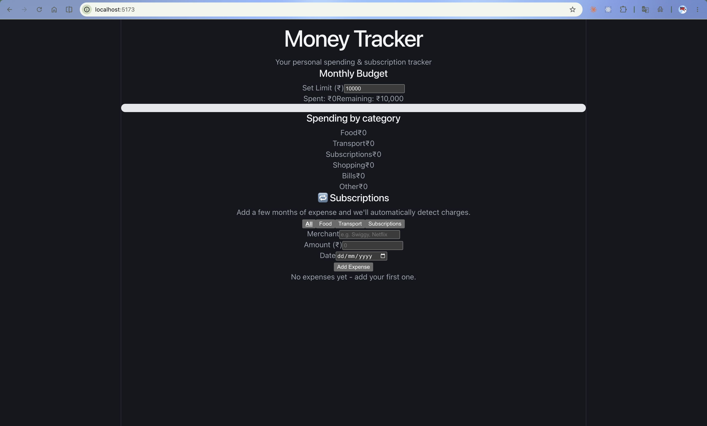

# Money Tracker

A spending & subscription tracker for Indian students and freelancers.



## What it does

- Auto-categorizes expenses by merchant name (Swiggy → Food, Netflix → Subscriptions, etc.)
- Shows total spending per category
- Filters the expense list by category
- Detects recurring subscriptions
- Persists data across refreshes with localStorage

## Tech

- **React 18** with hooks (`useState`)
- **TypeScript** — typed components, typed data model
- **Vite** — instant hot-reload dev server
- **Plain JavaScript logic** in `src/lib/` — no framework dependency

## Run locally

```
npm install
npm run dev
```

## Project structure

```text
src/
├── components/
│ ├── Header.tsx
│ ├── ExpenseList.tsx
│ ├── ExpenseItem.tsx
│ └── Summary.tsx
├── lib/
│ ├── data.ts
│ └── logic.ts
└── types.ts
```
